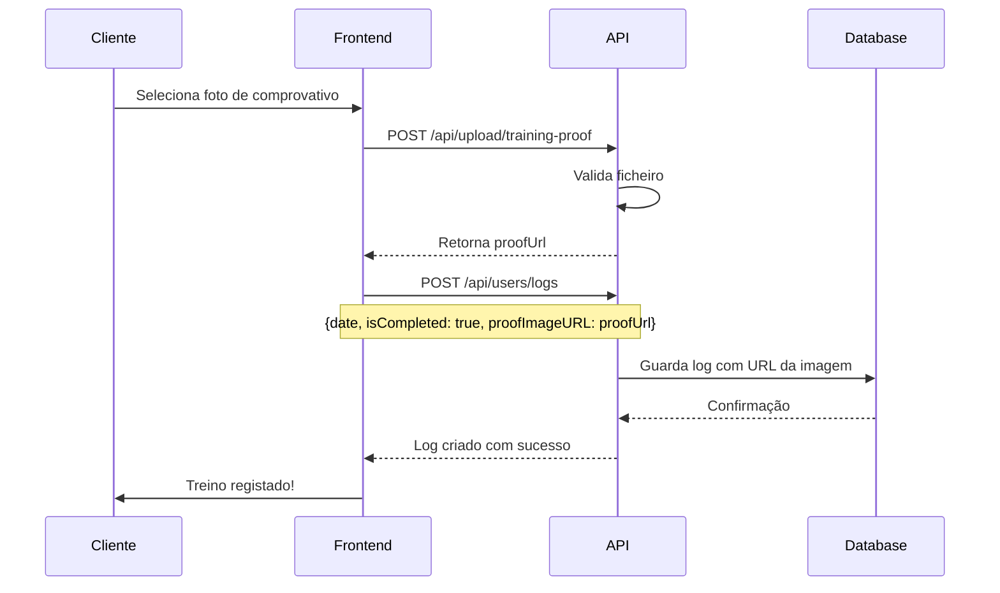

# Upload de Imagens - Guia de Utilização

## 📁 Sistema de Upload Implementado

O sistema de upload suporta três categorias de ficheiros:
- **Avatars** - Fotos de perfil dos utilizadores
- **Proofs** - Comprovativos de treino (screenshots, fotos)
- **Exercises** - Imagens e vídeos de exercícios

---

## 🔧 Configuração

### Diretórios Automáticos

Os seguintes diretórios são criados automaticamente ao iniciar o servidor:
```
uploads/
├── avatars/      # Fotos de perfil
├── proofs/       # Comprovativos de treino
└── exercises/    # Imagens/vídeos de exercícios
```

### Limites e Restrições

| Propriedade | Valor |
|-------------|-------|
| Tamanho máximo | 10 MB |
| Formatos de imagem | JPEG, PNG, GIF, WebP |
| Formatos de vídeo | MP4, WebM, OGG (apenas exercícios) |

---

## 📡 Endpoints Disponíveis

### 1. Upload de Avatar

**Endpoint:** `POST /api/upload/avatar`  
**Autenticação:** Bearer Token (obrigatório)  
**Content-Type:** `multipart/form-data`

**Campo do formulário:**
- `avatar` (file) - Ficheiro de imagem

**Exemplo com cURL:**
```bash
curl -X POST http://localhost:5000/api/upload/avatar \
  -H "Authorization: Bearer SEU_TOKEN" \
  -F "avatar=@/caminho/para/foto.jpg"
```

**Resposta (200):**
```json
{
  "success": true,
  "message": "Avatar carregado com sucesso",
  "avatarUrl": "/uploads/avatars/avatar-1702401234567.jpg"
}
```

> [!NOTE]
> O URL do avatar é automaticamente atualizado no perfil do utilizador

---

### 2. Upload de Comprovativo de Treino

**Endpoint:** `POST /api/upload/training-proof`  
**Autenticação:** Bearer Token (obrigatório)  
**Content-Type:** `multipart/form-data`

**Campo do formulário:**
- `proofImage` (file) - Ficheiro de imagem

**Exemplo com cURL:**
```bash
curl -X POST http://localhost:5000/api/upload/training-proof \
  -H "Authorization: Bearer SEU_TOKEN" \
  -F "proofImage=@/caminho/para/comprovativo.jpg"
```

**Resposta (200):**
```json
{
  "success": true,
  "message": "Comprovativo de treino carregado com sucesso",
  "proofUrl": "/uploads/proofs/proofImage-1702401234567.jpg",
  "filename": "proofImage-1702401234567.jpg",
  "size": 245678
}
```

> [!IMPORTANT]
> Usar o `proofUrl` retornado ao criar/atualizar logs de treino

---

## 🧪 Testar no Swagger

### Passo 1: Aceder ao Swagger
```
http://localhost:5000/api-docs
```

### Passo 2: Autenticar
1. Fazer login em `POST /api/auth/login`
2. Copiar o token da resposta
3. Clicar em **"Authorize"** no topo
4. Inserir: `Bearer {token}`

### Passo 3: Testar Upload
1. Navegar até **Upload > POST /api/upload/avatar**
2. Clicar em **"Try it out"**
3. Clicar em **"Choose File"** e selecionar uma imagem
4. Clicar em **"Execute"**

---

## 💻 Exemplo de uso no Frontend

### Upload de Avatar (JavaScript)

```javascript
async function uploadAvatar(file, token) {
  const formData = new FormData();
  formData.append('avatar', file);
  
  const response = await fetch('http://localhost:5000/api/upload/avatar', {
    method: 'POST',
    headers: {
      'Authorization': `Bearer ${token}`
    },
    body: formData
  });
  
  const data = await response.json();
  console.log('Avatar URL:', data.avatarUrl);
  return data;
}
```

### Upload de Comprovativo (React)

```jsx
function UploadProofButton() {
  const handleUpload = async (event) => {
    const file = event.target.files[0];
    const token = localStorage.getItem('token');
    
    const formData = new FormData();
    formData.append('proofImage', file);
    
    try {
      const response = await fetch('/api/upload/training-proof', {
        method: 'POST',
        headers: { 'Authorization': `Bearer ${token}` },
        body: formData
      });
      
      const data = await response.json();
      
      if (data.success) {
        alert('Comprovativo enviado!');
        // Usar data.proofUrl para registar treino
      }
    } catch (error) {
      console.error('Erro:', error);
    }
  };
  
  return <input type="file" accept="image/*" onChange={handleUpload} />;
}
```

---

## 🔒 Segurança

### Validações Implementadas

✅ **Autenticação obrigatória** - Todas as rotas requerem token JWT  
✅ **Validação de tipo MIME** - Apenas imagens/vídeos permitidos  
✅ **Validação de extensão** - Lista branca de extensões  
✅ **Limite de tamanho** - Máximo 10MB por ficheiro  
✅ **Nomes únicos** - Timestamp + random para evitar colisões  

### Boas Práticas

> [!WARNING]
> - Nunca confiar apenas no frontend - validação sempre no backend
> - Verificar permissões antes de permitir upload
> - Implementar rate limiting para prevenir abuse
> - Considerar armazenamento em cloud (S3, Cloudinary) para produção

---

## 📝 Fluxo Completo: Cliente Registando Treino



---

## 🛠️ Middleware Disponíveis

Importar no código:
```javascript
const {
  uploadAvatar,          // Single avatar
  uploadProofImage,      // Single proof image
  uploadExerciseImage,   // Single exercise image
  uploadExerciseVideo,   // Single exercise video
  uploadMultipleImages,  // Até 5 imagens
  deleteFile            // Apagar ficheiro do sistema
} = require('../middlewares/uploadMiddleware');
```

---

## 📊 Estrutura de Dados

### User Model (campo avatar)
```javascript
{
  avatar: {
    type: String,
    default: null  // URL: "/uploads/avatars/avatar-123.jpg"
  }
}
```

### TrainingLog Model
```javascript
{
  proofImageURL: {
    type: String,
    default: null  // URL: "/uploads/proofs/proofImage-456.jpg"
  }
}
```

---

## ✅ Checklist de Implementação

- [x] Middleware de upload configurado
- [x] Diretórios criados automaticamente
- [x] Rota de upload de avatar
- [x] Rota de upload de comprovativo
- [x] Validação de tipos de ficheiro
- [x] Limite de tamanho
- [x] Integração com servidor
- [x] Documentação Swagger
- [x] Exemplos de uso

---

## 🚀 Próximos Passos Sugeridos

1. **Otimização de Imagens**
   - Implementar Sharp para redimensionar/comprimir
   - Gerar thumbnails automáticos

2. **Cloud Storage**
   - Integrar AWS S3 ou Cloudinary
   - CDN para entrega mais rápida

3. **Gestão de Ficheiros**
   - Rota para apagar ficheiros antigos
   - Cleanup automático de uploads órfãos

4. **Validações Avançadas**
   - Scan de vírus/malware
   - Detecção de conteúdo impróprio
